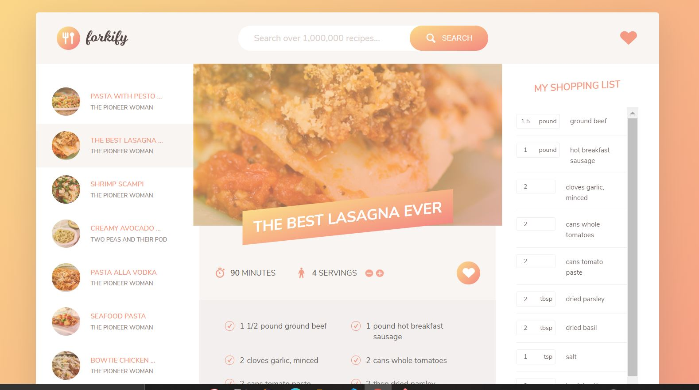

# Forkify_JS_app
A recipe search/shop application using NPM, ES6, Babel and Webpack.
This application using the *Forkify API* to get details from a wide variety of recipes, allows users to manage those recipes ,save the required ingredients based on the number pf servings. Then a user can add them to their shopping cart, or add them to favorites , which is persisted using local storage. 
It is developed using ES6, NPM, Babel and Webpack.

[View the Live demo here](happy-wilson-9b5fb2.netlify.app/)

